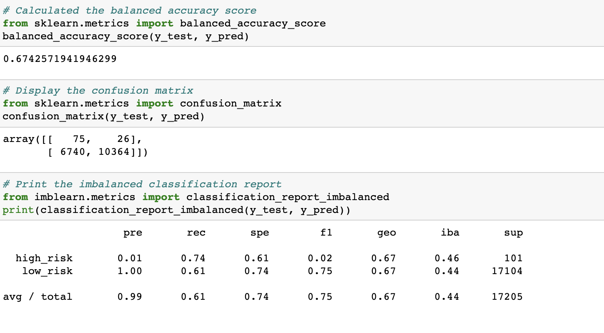
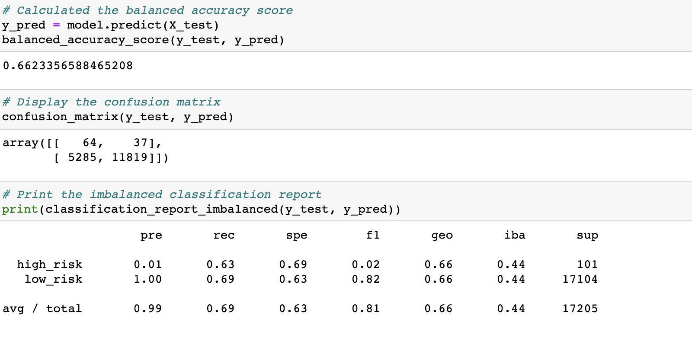
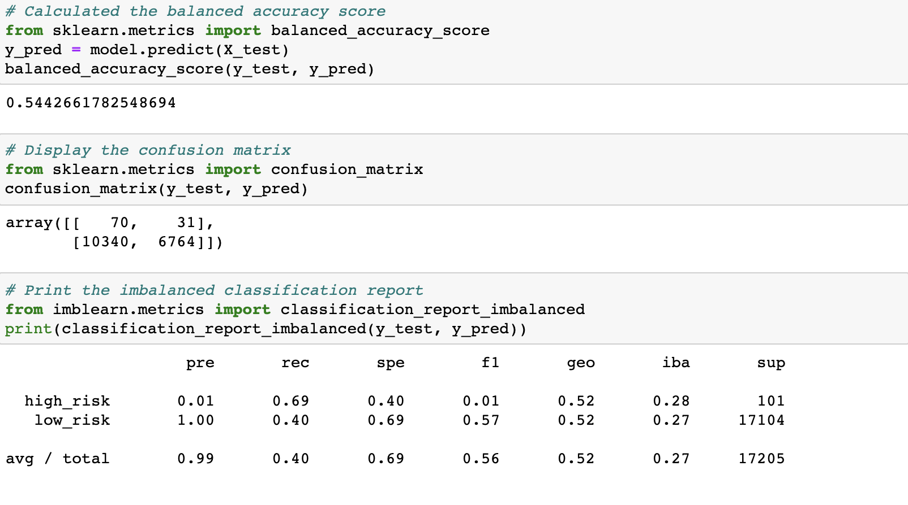
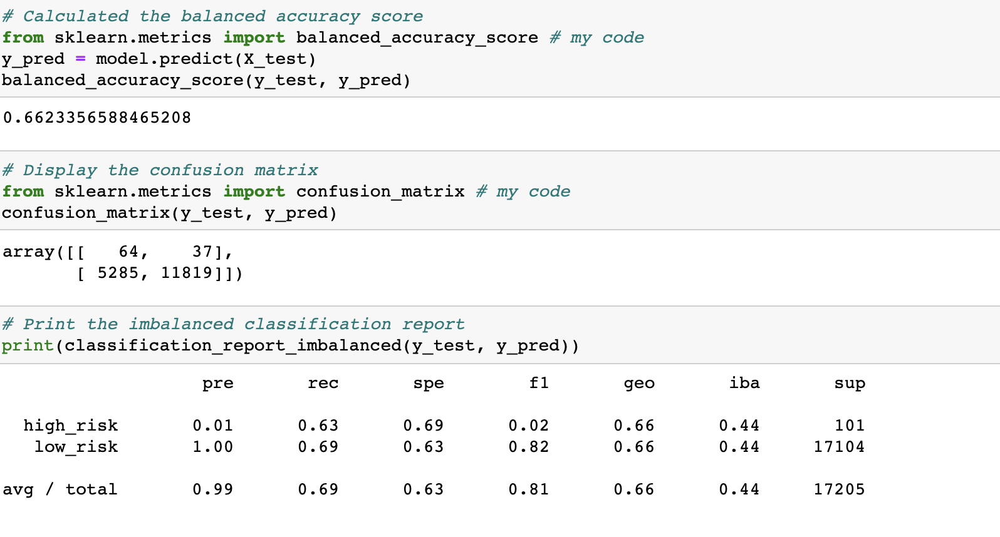
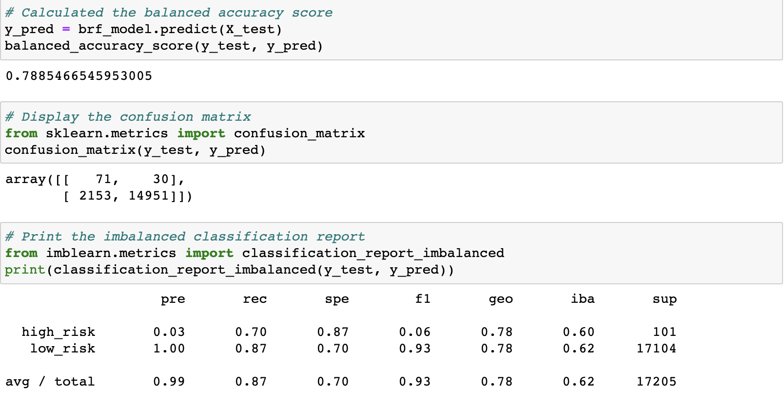
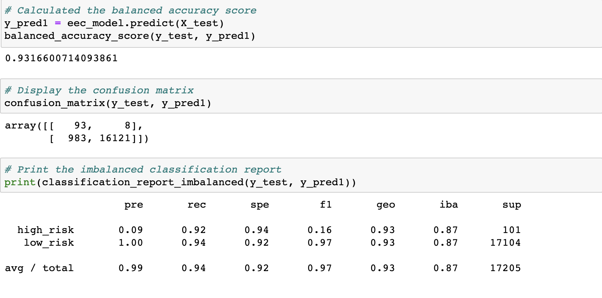

# Credit_Risk_Analysis

## Overview of the loan prediction risk analysis:

Credit risk is an inherently unbalanced classification problem, as good loans easily outnumber risky loans. I will need to employ different techniques to train and evaluate models with unbalanced classes. 

Using the credit card credit dataset from LendingClub, a peer-to-peer lending services company, I’ll oversample the data using the RandomOverSampler and SMOTE algorithms, and undersample the data using the ClusterCentroids algorithm. Then, I’ll use a combinatorial approach of over- and undersampling using the SMOTEENN algorithm. Next, you’ll compare two new machine learning models that reduce bias, BalancedRandomForestClassifier and EasyEnsembleClassifier, to predict credit risk. Once you’re done, you’ll evaluate the performance of these models and make a written recommendation on whether they should be used to predict credit risk.

Deliverable 1: Use Resampling Models to Predict Credit Risk

Deliverable 2: Use the SMOTEENN Algorithm to Predict Credit Risk

Deliverable 3: Use Ensemble Classifiers to Predict Credit Risk

## Results:

### Deliverable 1: Use Resampling Models to Predict Credit Risk

I compared two oversampling algorithms to determine which algorithm results in the best performance. I oversampled the data using the naive random oversampling algorithm and the SMOTE algorithm. 

- Naive Random Oversampling

Accuracy score is 67%

Precision score is 0.01

Recall score is 0.61

F1 score is 0.02

- SMOTE Oversampling

Accuracy score is 66%

Precision score is 0.01

Recall score is 0.63

F1 score is 0.02

Naive and SMOTE algorithms have similar results. Both methods did not provide useful model for the prediction of bad loans.

- Undersampling using ClusterCentroids resampler

I tested an undersampling algorithms to determine which algorithm results in the best performance compared to the oversampling algorithms above. You will undersample the data using the Cluster Centroids algorithm.

Accuracy score is 54%

Precision score is 0.01

Recall score is 0.69

F1 score is 0.01

Undersampling has provided low indicators, simikar to Naive and SMOTE algorithms. 

### Deliverable 2: Use the SMOTEENN Algorithm to Predict Credit Risk

- Combination (Over and Under) Sampling

I tested a combination over- and under-sampling algorithm to determine if the algorithm results in the best performance compared to the other sampling algorithms above. You will resample the data using the SMOTEENN algorithm.

Accuracy score is 66%

Precision score is 0.01

Recall score is 0.63

F1 score is 0.02

The perfomance of Combination (Over and Under) Sampling algorithm showed poor result as well.

### Deliverable 3: Use Ensemble Classifiers to Predict Credit Risk

I compared two ensemble algorithms to determine which algorithm results in the best performance. I trained a Balanced Random Forest Classifier and an Easy Ensemble AdaBoost classifier .

- Balanced Random Forest Classifier

Accuracy score is 79%

Precision score is 0.03

Recall score is 0.70

F1 score is 0.06

- Easy Ensemble AdaBoost Classifier

Accuracy score is 93%

Precision score is 0.09

Recall score is 0.92

F1 score is 0.16

## Summary:

There is a summary of the results (2 pt)
There is a recommendation on which model to use, or there is no recommendation with a justification (3 pt)
